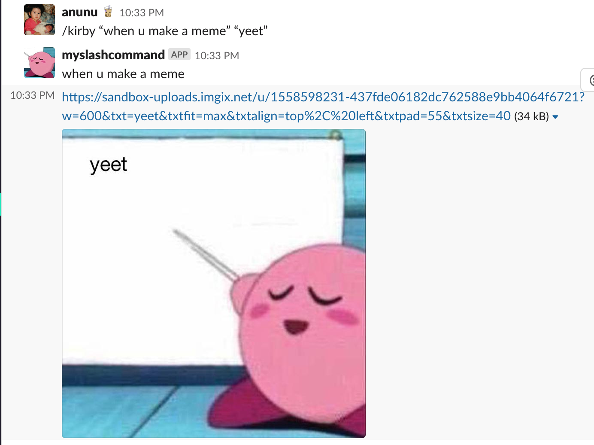

# kirby-slack-generator

A very simple Slack slack command that generates a customized kirby "im baby" meme.

## Set up

As this Slack was built while following the tutorial on easy peasy Slash commands, refer to the tutorial to set up and deploy the app: 
 
https://medium.com/slack-developer-blog/easy-peasy-slash-commands-getting-started-c37ff3f14d3e

## Usage

On the channel on your Slack workspace, enter:

```/kirby "top caption here" "words to go on the billboard```



Unfortunately, this only prints in a single line, but will shrink the text accordingly to fit the image (ie. it might be very small if your line is too long). Enjoy! 